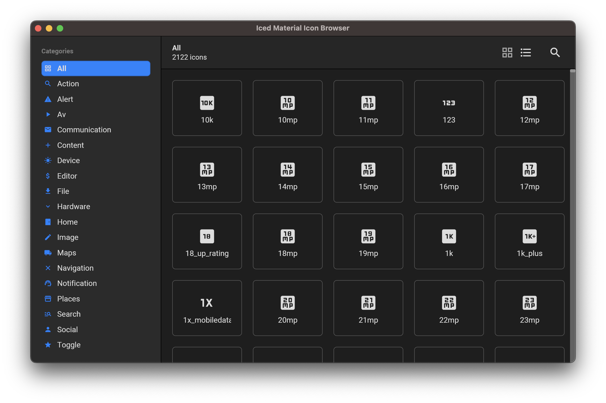

# Iced Material Icon Browser

`Iced Material Icon Browser` is a simple [Iced](https://github.com/iced-rs/iced) application that I wrote as a learning activity, which allows you to browse the full list of regular [Material Icons (by Google)](https://fonts.google.com/icons). The design is inspired by macOS' [SF Symbols](https://developer.apple.com/sf-symbols/) application.



## Quick preview


## Target audience

This project is mainly targeted at Rust programmers who are in the process of learning Iced. It makes use of concepts such as:
* performing custom styling,
* using scrollers,
* creating and using commands,
* importing and configuring custom fonts (text and icons),
* creating custom widgets,
* using Iced's `subscription` method,
* and other stuff.

## Disclaimer 

I, myself, am in the process of learning Iced, so it is possible that some of the patterns I am using in this project don't 100% make sense.

## How to build the project

**<ins>A note to Windows users</ins>:** I have yet to confirm that the calls I'm making to the `include_bytes!` macro in `./src/main.rs` will work as intended on Windows systems. Please [let me know](#contact) if it doesn't.

1. Clone the Git repository from GitHub:
```
git clone https://github.com/BB-301/iced-material-icon-browser.git
```

2. Build the project:
```
cd iced-material-icon-browser
cargo build --release
```

3. Run the application:
```
cargo run --release
```

## Still to do...

* When in a `grid view` mode and clicking on an item, the content view will be split in two, which will likely result in the selected item in the list getting redrawn out of view (the other way around is also possible; i.e. when closing the preview). In a next version, I want to track the active item's position in the scroller and use a command to bring it back into view.
* I acknowledge that there is a fair amount of repetitive code in some of the methods of my `impl MyApp`, which could be refactored into other helper methods to enable reuse. The `view_item_preview` method is a good example of that.

## Contact

Please feel free to contact me by opening an issue on the [repository](https://github.com/BB-301/iced-material-icon-browser/issues) if you have any questions, issues or suggestions for this project.

## License

I am releasing this project under the [MIT License](LICENSE).